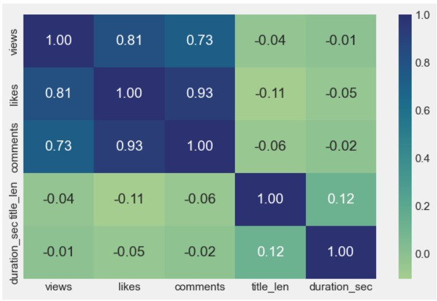
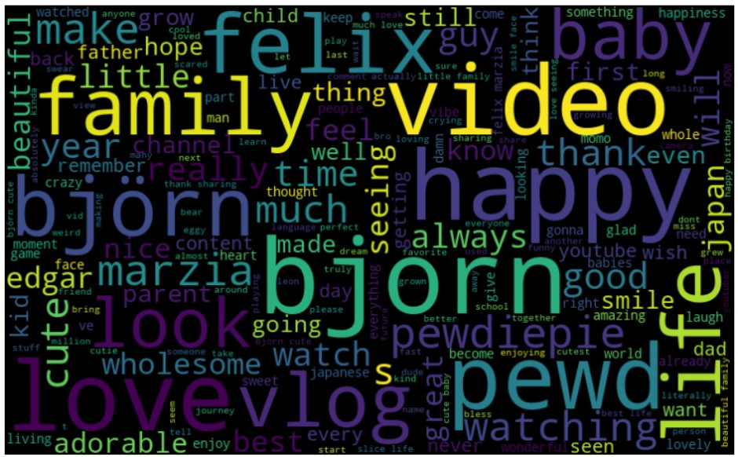

<h1 align = 'center'>YouTube View Count Prediction and Viewers Analsysis Model</h1>
 

## Description:
This model focuses on the predictive analysis of YouTube view counts, employing the CatBoost algorithm to model and forecast viewership trends. Leveraging the [YouTube API](https://developers.google.com/youtube/v3), data was collected from a specific channel, encompassing video metadata and comment section sentiment analysis to provide a comprehensive understanding of audience engagement dynamics. 

## Techn Stack

 

`Language` : Python  
`Library` : Pandas, Matplotlib, Seaborn, NLTK  
`Platform` : Juypter Notebook  

## Output
View Count Analysis Output:

 <h3>Views Plot</h3>

 <h3>Scatter Plot</h3>

 <h3>Views Histogram</h3>

<h3>Views Log Histogram</h3>

<h3>Seasonal Decomposition</h3>

<h3>Seasonal Pattern</h3>

 <h3>Data Distribution Plot</h3>

 <h3>Heatmap</h3>

  <h3>Catboost (without addition feature)</h3>

Viewer Analysis Output:

 <h3>Boxplot</h3>

 <h3>Sentiment Distribution</h3>

 <h3>Wordcloud</h3>

 
## Data collection
Data collection was facilitated through the YouTube API, enabling the extraction of video metadata such as title, description, and tags, along with engagement metrics including likes, dislikes, and comments. Additionally, sentiment analysis was performed on the comment section to gauge audience sentiment and its impact on viewership. 

 ## CatBoost algorithm
The CatBoost algorithm, known for its robustness in handling categorical variables and its ability to mitigate overfitting, was chosen for its suitability in predicting view counts amidst the complex landscape of YouTube content. Through feature engineering and model optimization, our analysis aimed to uncover the key factors influencing video popularity and viewership dynamics. 

## Result
The results of our analysis highlight the significance of various factors such as video length, title sentiment, and viewer interaction in influencing view counts. Furthermore, the CatBoost model demonstrated strong predictive performance, accurately capturing the nuances of audience behavior and content preferences.
